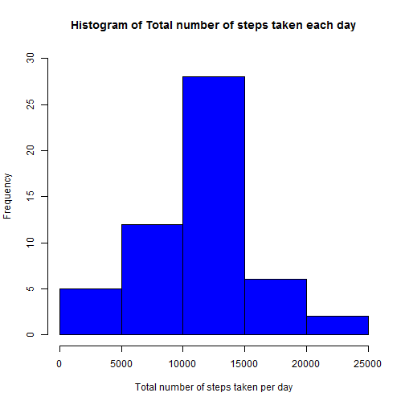
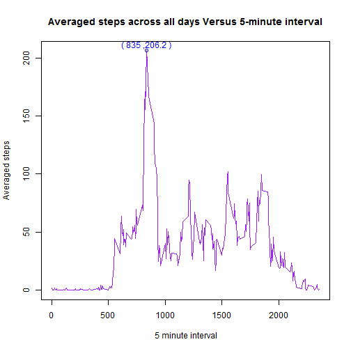
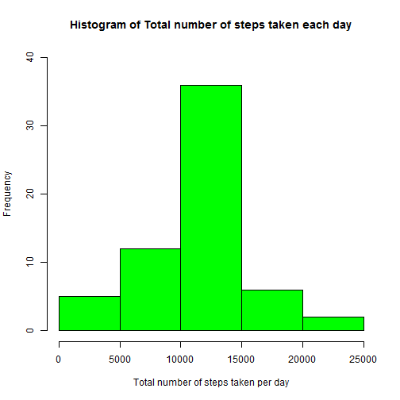
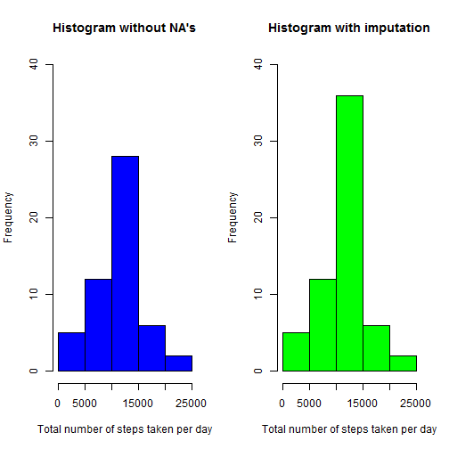
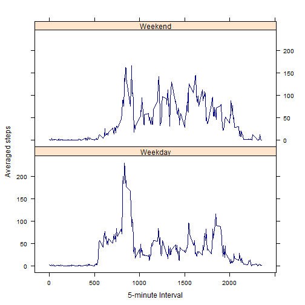

# Reproducible Research: Peer Assessment 1
## Introduction
________________
This report will be discussing the data analysis about the activity monitoring dataset. The report will include the R code and the plots describing the data analysis. The structure of the report is as follows:
* Loading and preprocessing the data.
* Mean total number of steps taken per day and median total number of steps taken per day discarding the missing values.
* Average daily activity pattern.
* Imputing missing values and how imputing affects the data.
* Activity patterns during weekdays and weekends.

## Loading and preprocessing the data
The dataset is available in the github repository itself and hence reading the dataset directly from the repo.


```r
## Libraries of data.table and lattice are loaded to R
library(data.table)
library(lattice)
##Unzipping the file and reading it using read.csv()
unzippedfile <- unz("./activity.zip","activity.csv")
activityDF <- read.csv(unzippedfile, colClasses = c("numeric", "Date", "numeric"))
unlink(unzippedfile)
rm(unzippedfile)
## Converting the data frame to data table
activityDT <- data.table(activityDF)
## Number of columns is printed
ncol(activityDT)
```

```
## [1] 3
```

```r
## Number of rows is printed
nrow(activityDT)
```

```
## [1] 17568
```

```r
head(activityDT,4)
```

```
##    steps       date interval
## 1:    NA 2012-10-01        0
## 2:    NA 2012-10-01        5
## 3:    NA 2012-10-01       10
## 4:    NA 2012-10-01       15
```

```r
tail(activityDT,4)
```

```
##    steps       date interval
## 1:    NA 2012-11-30     2340
## 2:    NA 2012-11-30     2345
## 3:    NA 2012-11-30     2350
## 4:    NA 2012-11-30     2355
```

```r
## Missing values NA are removed by using na.omit()
naremovedDT <- na.omit(activityDT)
head(naremovedDT,4)
```

```
##    steps       date interval
## 1:     0 2012-10-02        0
## 2:     0 2012-10-02        5
## 3:     0 2012-10-02       10
## 4:     0 2012-10-02       15
```

```r
tail(naremovedDT,4)
```

```
##    steps       date interval
## 1:     0 2012-11-29     2340
## 2:     0 2012-11-29     2345
## 3:     0 2012-11-29     2350
## 4:     0 2012-11-29     2355
```

```r
## number of rows without the missing values NA is printed
nrow(naremovedDT)
```

```
## [1] 15264
```

## What is mean total number of steps taken per day?
In this section, data analysis is preformed by calculating the mean total number of steps taken per day and the median total number of steps taken per day by discarding the missing values NA. The histogram of the total number of steps per day is plotted to examine the pattern.

```r
## Total number of steps per day is calculated by using the function sum()
totalsteps <- naremovedDT[, sum(steps), by =date]
head(totalsteps,4)
```

```
##          date    V1
## 1: 2012-10-02   126
## 2: 2012-10-03 11352
## 3: 2012-10-04 12116
## 4: 2012-10-05 13294
```

```r
hist(totalsteps$V1, col= "blue", xlab = "Total number of steps taken per day", main = "Histogram of Total number of steps taken each day", ylim = c(0,30))
```

 

```r
meansteps <-mean(totalsteps$V1)
mediansteps <- median(totalsteps$V1)
format(meansteps, digits = 8)
```

```
## [1] "10766.189"
```

```r
format(mediansteps, digits = 8)
```

```
## [1] "10765"
```
The mean total number of steps per day is 10766.189 and the median total number of steps per day is 10765. From the histogram, it is clear that the most of the total number of steps taken per day is between 10000 and 15000.

## What is the average daily activity pattern?
In this section, data analysis of which 5-minute interval has the maximum averaged steps taken across all days is examined. The plot is generated between the time series of 5-minute interval and the averaged steps across all the days. 

```r
## Averaged steps across all days is calculated by using the function mean()
averagesteps <- naremovedDT[, mean(steps), by=interval]
head(averagesteps,4)
```

```
##    interval     V1
## 1:        0 1.7170
## 2:        5 0.3396
## 3:       10 0.1321
## 4:       15 0.1509
```

```r
tail(averagesteps,4)
```

```
##    interval     V1
## 1:     2340 3.3019
## 2:     2345 0.6415
## 3:     2350 0.2264
## 4:     2355 1.0755
```

```r
str(averagesteps)
```

```
## Classes 'data.table' and 'data.frame':	288 obs. of  2 variables:
##  $ interval: num  0 5 10 15 20 25 30 35 40 45 ...
##  $ V1      : num  1.717 0.3396 0.1321 0.1509 0.0755 ...
##  - attr(*, ".internal.selfref")=<externalptr>
```

```r
summary(averagesteps)
```

```
##     interval          V1        
##  Min.   :   0   Min.   :  0.00  
##  1st Qu.: 589   1st Qu.:  2.49  
##  Median :1178   Median : 34.11  
##  Mean   :1178   Mean   : 37.38  
##  3rd Qu.:1766   3rd Qu.: 52.83  
##  Max.   :2355   Max.   :206.17
```

```r
with(averagesteps, plot(interval,V1, type="l", col="purple", xlab = " 5 minute interval", ylab = "Averaged steps", main = "Averaged steps across all days Versus 5-minute interval"))
## 5- minute interval at which maximum averaged steps is calculated
## using which.max()
maxs <- which.max(averagesteps$V1)
maxin <- averagesteps$interval[maxs]
with(averagesteps, points(maxin,max(averagesteps$V1), pch = 1, col="blue"))
newvar <- paste0("( ", maxin)
newvaa <- paste0(newvar, " ,")
newvab <- paste0(format(max(averagesteps$V1), digits = 4), " )")
with(averagesteps, text(maxin, max(averagesteps$V1) + 5, paste0(newvaa,newvab), col= "blue"))
```

 

The maximum number of averaged steps across all the days - 206.2 occurs at 5-minute interval of 835. There is broader region of least averaged steps across all the days and it occurs within the 5-minute interval of 0 and 500. Activity varies very significantly with the 5-minute interval.

## Imputing missing values
In this section, imputation technique is applied to the missing values by using the mean of all the steps (across all the days) for that 5- minute interval. Since thesteps averaged across all the days significantly varies with the 5-minute rather than with day, the steps averaged across all the days for that 5-minute interval is used to substitute the missing values NA in the original dataset.  

```r
## calculating the number of rows that has missing values NA for steps
naDT <- activityDT[is.na(activityDT$steps),][,]
nrow(naDT)
```

```
## [1] 2304
```
The number of rows of the original dataset that has missing values NA for "steps" is 2304.


```r
## calculating the mean of the steps grouped by interval and assigning to a ## new column in the data table
newactivityDT <- activityDT[,meansteps := mean(steps, na.rm= TRUE), by = interval]
## Re-assigning the calculated mean only to the missing values NA of the 
## column "steps""
newactivityDT$steps[which(is.na(newactivityDT$steps))] <- newactivityDT$meansteps[which(is.na(newactivityDT$steps))]
## New dataset created using imputation technique for missing values NA
nactivityDT <- newactivityDT[,!"meansteps", with=FALSE]
nrow(nactivityDT)
```

```
## [1] 17568
```

```r
## Verifying that the new dataset contains NA
na.fail(nactivityDT)
```

```
##          steps       date interval
##     1: 1.71698 2012-10-01        0
##     2: 0.33962 2012-10-01        5
##     3: 0.13208 2012-10-01       10
##     4: 0.15094 2012-10-01       15
##     5: 0.07547 2012-10-01       20
##    ---                            
## 17564: 4.69811 2012-11-30     2335
## 17565: 3.30189 2012-11-30     2340
## 17566: 0.64151 2012-11-30     2345
## 17567: 0.22642 2012-11-30     2350
## 17568: 1.07547 2012-11-30     2355
```

```r
## Calculating the total number of steps taken per day after imputation
naintotalsteps <- nactivityDT[, sum(steps), by =date]
head(naintotalsteps,4)
```

```
##          date    V1
## 1: 2012-10-01 10766
## 2: 2012-10-02   126
## 3: 2012-10-03 11352
## 4: 2012-10-04 12116
```

```r
## Histogram is ploted
hist(naintotalsteps$V1, col= "green", xlab = "Total number of steps taken per day", main = "Histogram of Total number of steps taken each day", ylim = c(0,40))
```

 

```r
## mean total number of steps per day is calculated
nainmeansteps <-mean(naintotalsteps$V1)
## median total number of steps per day is calculated
nainmediansteps <- median(naintotalsteps$V1)
format(nainmeansteps, digits = 8)
```

```
## [1] "10766.189"
```

```r
format(nainmediansteps, digits =8)
```

```
## [1] "10766.189"
```
After imputation, it is evident from the histogram that the total number of steps taken per day has increased in frequency for the range of total number of steps - 10000 to 15000, as "mean"" is used for imputation. The mean continues to be the same value 10766.189 as mean is used to substitute the missing values. Median of the new data 10766.189 is same as the value of the mean and has increased from the original and differs by -1.1887 from the median calculated discarding the missing values. For comparison, the histogram without missing values and histogram with imputation is plotted.

```r
## two historgrams are plotted side by side using function par()
par(mfrow = c(1,2))
hist(totalsteps$V1, col= "blue", xlab = "Total number of steps taken per day", main = "Histogram without NA's", ylim = c(0,40))
hist(naintotalsteps$V1, col= "green", xlab = "Total number of steps taken per day", main = "Histogram with imputation", ylim = c(0,40))
```

 

For comparison, the histogram without missing values and histogram with imputation is plotted above. 

## Are there differences in activity patterns between weekdays and weekends?
In this section, the activity patterns during weekdays and weekends are examined. 

```r
## new column of dayfactor is added 
newactivityDT[weekdays(date) %in% c("Monday", "Tuesday", "Wednesday", "Thursday", "Friday"), dayfactor := as.factor("Weekday")]
```

```
##          steps       date interval meansteps dayfactor
##     1: 1.71698 2012-10-01        0   1.71698   Weekday
##     2: 0.33962 2012-10-01        5   0.33962   Weekday
##     3: 0.13208 2012-10-01       10   0.13208   Weekday
##     4: 0.15094 2012-10-01       15   0.15094   Weekday
##     5: 0.07547 2012-10-01       20   0.07547   Weekday
##    ---                                                
## 17564: 4.69811 2012-11-30     2335   4.69811   Weekday
## 17565: 3.30189 2012-11-30     2340   3.30189   Weekday
## 17566: 0.64151 2012-11-30     2345   0.64151   Weekday
## 17567: 0.22642 2012-11-30     2350   0.22642   Weekday
## 17568: 1.07547 2012-11-30     2355   1.07547   Weekday
```

```r
newactivityDT[weekdays(date) %in% c("Saturday", "Sunday"), dayfactor := as.factor("Weekend")]
```

```
##          steps       date interval meansteps dayfactor
##     1: 1.71698 2012-10-01        0   1.71698   Weekday
##     2: 0.33962 2012-10-01        5   0.33962   Weekday
##     3: 0.13208 2012-10-01       10   0.13208   Weekday
##     4: 0.15094 2012-10-01       15   0.15094   Weekday
##     5: 0.07547 2012-10-01       20   0.07547   Weekday
##    ---                                                
## 17564: 4.69811 2012-11-30     2335   4.69811   Weekday
## 17565: 3.30189 2012-11-30     2340   3.30189   Weekday
## 17566: 0.64151 2012-11-30     2345   0.64151   Weekday
## 17567: 0.22642 2012-11-30     2350   0.22642   Weekday
## 17568: 1.07547 2012-11-30     2355   1.07547   Weekday
```

```r
summary(newactivityDT)
```

```
##      steps            date               interval      meansteps     
##  Min.   :  0.0   Min.   :2012-10-01   Min.   :   0   Min.   :  0.00  
##  1st Qu.:  0.0   1st Qu.:2012-10-16   1st Qu.: 589   1st Qu.:  2.49  
##  Median :  0.0   Median :2012-10-31   Median :1178   Median : 34.11  
##  Mean   : 37.4   Mean   :2012-10-31   Mean   :1178   Mean   : 37.38  
##  3rd Qu.: 27.0   3rd Qu.:2012-11-15   3rd Qu.:1766   3rd Qu.: 52.83  
##  Max.   :806.0   Max.   :2012-11-30   Max.   :2355   Max.   :206.17  
##    dayfactor    
##  Weekday:12960  
##  Weekend: 4608  
##                 
##                 
##                 
## 
```

```r
str(newactivityDT)
```

```
## Classes 'data.table' and 'data.frame':	17568 obs. of  5 variables:
##  $ steps    : num  1.717 0.3396 0.1321 0.1509 0.0755 ...
##  $ date     : Date, format: "2012-10-01" "2012-10-01" ...
##  $ interval : num  0 5 10 15 20 25 30 35 40 45 ...
##  $ meansteps: num  1.717 0.3396 0.1321 0.1509 0.0755 ...
##  $ dayfactor: Factor w/ 2 levels "Weekday","Weekend": 1 1 1 1 1 1 1 1 1 1 ...
##  - attr(*, ".internal.selfref")=<externalptr>
```

```r
## average of the steps across all the days are calculated after grouped
## by both 5-minute interval and dayfactor (weekday or weekend)
nainaveragesteps <- newactivityDT[, mean(steps), by="interval,dayfactor"]
head(nainaveragesteps,4)
```

```
##    interval dayfactor     V1
## 1:        0   Weekday 2.2512
## 2:        5   Weekday 0.4453
## 3:       10   Weekday 0.1732
## 4:       15   Weekday 0.1979
```

```r
tail(nainaveragesteps,4)
```

```
##    interval dayfactor     V1
## 1:     2340   Weekend 6.2877
## 2:     2345   Weekend 1.7052
## 3:     2350   Weekend 0.0283
## 4:     2355   Weekend 0.1344
```

```r
summary(nainaveragesteps)
```

```
##     interval      dayfactor         V1        
##  Min.   :   0   Weekday:288   Min.   :  0.00  
##  1st Qu.: 589   Weekend:288   1st Qu.:  2.05  
##  Median :1178                 Median : 28.13  
##  Mean   :1178                 Mean   : 38.99  
##  3rd Qu.:1766                 3rd Qu.: 61.26  
##  Max.   :2355                 Max.   :230.38
```

```r
str(nainaveragesteps)
```

```
## Classes 'data.table' and 'data.frame':	576 obs. of  3 variables:
##  $ interval : num  0 5 10 15 20 25 30 35 40 45 ...
##  $ dayfactor: Factor w/ 2 levels "Weekday","Weekend": 1 1 1 1 1 1 1 1 1 1 ...
##  $ V1       : num  2.251 0.445 0.173 0.198 0.099 ...
##  - attr(*, ".internal.selfref")=<externalptr>
```

```r
## Lattice plot is generated
xyplot(nainaveragesteps$V1 ~ nainaveragesteps$interval | nainaveragesteps$dayfactor, layout = c(1,2), xlab = "5-minute Interval", ylab = "Averaged steps", panel = function(x,y, ...){
  panel.xyplot(x,y,type="l", col = "darkblue")
  })
```

 

From the lattice plot, it is evident that the activity pattern is oscillatory over broader range during weekend and there are no high sharp peaks. Whereas the activity pattern peaks up sharp and more during certain 5-minute interval (835) during weekdays. Also, it is clear that the maximum averagedsteps calculated in section "average daily activity pattern" occurs during weekdays.
